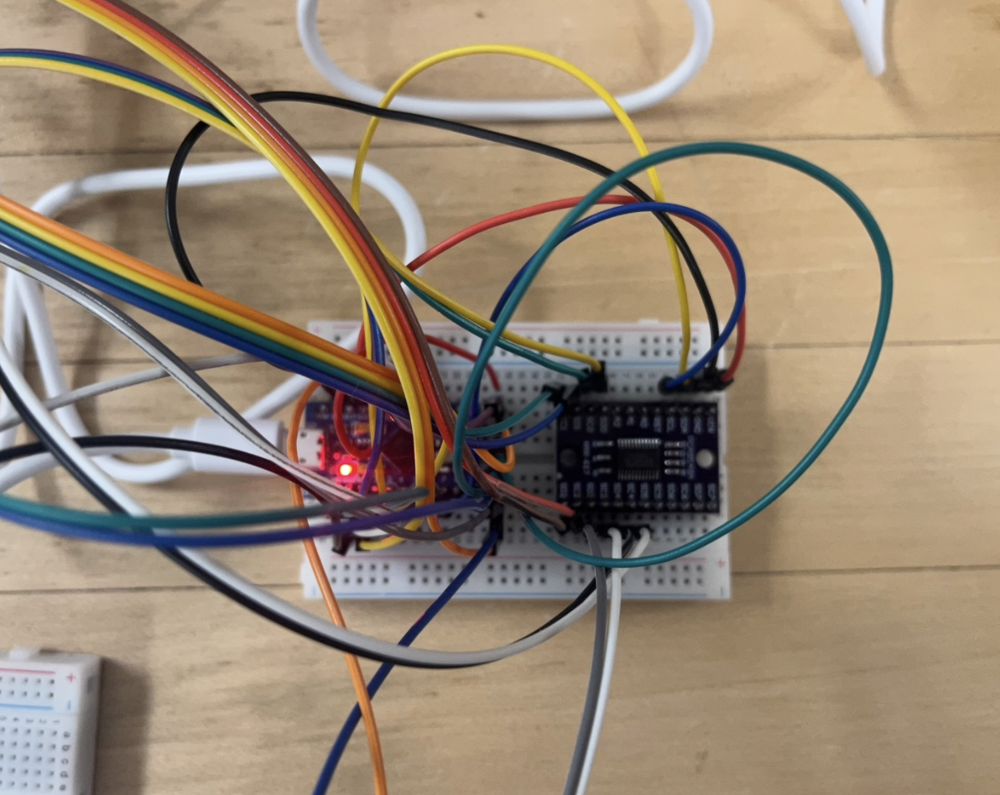

# Microcontroller-Based Clone Hero Guitar and Drum Controllers

Embedded Systems | Hardware Design | CAD | Microcontroller Programming | I2C Communication

## Project Overview

This project involved designing and building custom guitar and drum controllers for _Clone Hero_, a music-based video game. The goal was to create physical controllers that could communicate with a computer through a microcontroller, allowing the game to register button presses, joystick movements, and drum strikes as keyboard inputs.

The project initially began as an independent build and was later expanded through the Microcontrollers course at the University of Vermont. The completed guitar controller was also brought to the 2026 Women Can Do event, where high school students could interact with the project and learn more about electrical engineering.

## Project Objectives

- Build functional guitar and drum controllers compatible with _Clone Hero_
- Interface push buttons, a joystick, and pressure sensors with a microcontroller
- Program the controllers to translate physical inputs into keyboard commands
- Design a PCB to organize the electrical components
- Design and 3D print a housing for the guitar controller
- Test and troubleshoot the hardware and software

## Hardware

| Component | Function |
|---|---|
| Arduino Pro Micro (ATmega32U4) | Reads inputs and sends keyboard commands to the computer |
| LED Push Buttons | Five illuminated fret buttons for the guitar controller |
| Two-Axis Joystick | Detects upward and downward strumming |
| Adafruit MPRLS I2C Pressure Sensors (5) | Measure pressure changes caused by drum strikes |
| TCA9548A I2C Multiplexer | Allows five pressure sensors with the same I2C address to communicate with the microcontroller |
| Zeroing Push Button | Sets the current pressure readings as the baseline for all five sensors |
| Balloons and Flexible Tubing | Transfer pressure changes from drum strikes to the sensors |
| Wiring and Connectors | Connect the electronic components |
| 3D-Printed PLA Housing | Holds the guitar buttons, joystick, and electronics |
| Cardboard Housing | Holds the five balloons used for the drum controller |

## System Architecture

Both controllers followed the same general process:

1. **Input Detection:** The user presses a fret button, moves the joystick, or strikes a balloon.
2. **Signal Processing:** The microcontroller reads the corresponding digital, analog, or I2C sensor input.
3. **Input Mapping:** The detected input is assigned to a keyboard command.
4. **Communication:** The microcontroller sends the command to the computer through USB HID keyboard emulation.
5. **Game Response:** Clone Hero registers the input as a guitar or drum action.

## Software Implementation

Separate Arduino programs were developed for the guitar and drum controllers. Both used the ATmega32U4's native USB HID capabilities to send keyboard commands directly to the computer without requiring additional software.

The guitar program monitored the five fret buttons and the joystick's analog position. Each button was mapped to a keyboard key, while the joystick used directional thresholds to determine whether the user was strumming up or down.

The drum program was more involved because it required communication with five I2C pressure sensors. The program selected each sensor through the multiplexer, measured its pressure relative to a calibrated baseline, and registered a drum hit when the pressure change exceeded a set threshold. Release thresholds and cooldown timing were also used to prevent a single strike from registering multiple times.

**Programming Language:** C/C++  
**Microcontroller:** Arduino Pro Micro (ATmega32U4)  
**Development Environment:** Arduino IDE  
**Libraries:** Keyboard.h, Wire.h, Adafruit_MPRLS.h

## Design and Implementation

### Guitar Controller

The guitar controller used five LED-illuminated push buttons as fret buttons and a two-axis joystick as the strumming mechanism. Each fret button was connected to a digital input on the microcontroller, while the joystick's vertical position was read through an analog input. Moving the joystick up or down would register the corresponding strum command in Clone Hero.

The housing was based on a hollow guitar model found in an online repository and 3D printed using PLA. The printed parts were then modified to fit the buttons, joystick, and wiring. The buttons were soldered and installed into the housing, with the microcontroller and remaining electrical connections placed inside.

### Drum Controller

The drum controller used five balloons connected through flexible tubing to individual Adafruit MPRLS pressure sensors. When a balloon was struck, the air pressure inside increased, and the corresponding sensor measured the change.

One challenge was connecting all five sensors to the same microcontroller. Since the sensors had identical I2C addresses, a TCA9548A multiplexer was used to communicate with them individually.

A zeroing button was also added to calibrate the sensors. When pressed, the current pressure reading from each balloon was stored as its baseline. This was important because the balloons did not all have the same starting pressure, and the controller needed to detect pressure changes rather than absolute pressure.

A drum hit was registered when the pressure increased by at least 0.02 PSI above the calibrated baseline. Additional release thresholds and a short cooldown period helped prevent repeated inputs from a single strike.

The housing was made from interconnected cardboard boxes, each holding one balloon securely in place. The tubing ran from the balloons to the sensors, which were connected to the microcontroller through the multiplexer.

## Testing and Troubleshooting

### Microcontroller Selection

One of the first challenges was finding an affordable microcontroller capable of sending keyboard inputs directly to a computer.

The project initially used an Arduino Mega, but it was later discovered that the ATmega32U4 chip supported native USB HID keyboard emulation. This led to switching to an Arduino Pro Micro, which could send keyboard commands directly to Clone Hero without additional software.

To test this, a single push button was connected to the Pro Micro and programmed to send a keyboard character when pressed. Once this worked, the design was expanded to include all five fret buttons and the joystick.

### Pressure Sensor Calibration

The drum controller required additional testing to determine how much pressure change should count as a hit.

Testing began with one balloon and pressure sensor. Different pressure thresholds were evaluated to find a value that could reliably detect a strike without triggering from smaller pressure fluctuations.

A threshold of 0.02 PSI was selected, along with a release threshold of 0.01 PSI below the trigger level and a 150 ms cooldown. These parameters helped prevent repeated triggering and made the controller more consistent during gameplay.

Once the single-sensor setup was working, the system was expanded to five sensors using the I2C multiplexer. The Arduino Serial Monitor was used to check sensor readings, calibration values, and hit detection during testing.

Both controllers were eventually tested in Clone Hero to verify that the physical inputs were correctly recognized by the game.

## Project Media

### Guitar Controller Design

  
  

  <em>Figure 1. Initial guitar controller design (left) and key binding map (right).</em>

### Guitar Controller CAD Design

  

  <em>Figure 2. CAD models and design files used for the guitar controller housing.</em>

### Guitar Controller Assembly and Final Design

  
  
  

  <em>Figure 3. Soldered fret buttons (left), completed guitar controller front view (middle), and back view (right).</em>

### Community Outreach — Women Can Do 2026

  

  <em>Figure 4. Guitar controller brought to the 2026 Women Can Do event, where high school students could try the controller and learn about electrical engineering.</em>

### Drum Controller Design

  
  

  <em>Figure 5. Initial drum controller design (left) and key mapping (right).</em>

### Final Drum Controller Design

  
  

  <em>Figure 6. Final drum controller showing the top view (left) and side view (right).</em>

### Guitar Controller Circuit Schematic

  

  <em>Figure 7. Guitar controller circuit schematic showing the microcontroller, fret buttons, LEDs, and joystick connections.</em>

**Note:** No photographs were taken of the initial breadboard prototype. The schematic above shows the electrical connections used during development. The final controller used an Arduino Pro Micro.

### Drum Controller Circuit Schematic and Breadboard Prototype

  
  

  <em>Figure 8. Drum controller circuit schematic (left) and breadboard prototype (right), showing the microcontroller, I2C multiplexer, and pressure sensor connections.</em>

## Future Improvements

A custom PCB was originally planned to replace the breadboard and wiring connections, but it was not integrated due to budget constraints. This would be one of the main improvements in a future version, since it would make the electronics more compact, organized, and reliable.

Other possible improvements include:

- Replacing the joystick with a spring-loaded strum bar for a more realistic guitar controller
- Adding velocity-sensitive drum detection to distinguish between lighter and harder strikes
- Replacing the balloons with more durable drum surfaces
- Improving the internal mounting and wire management of both controllers

## Project Information

**Course:** Microcontrollers (CMPE3815)

**Institution:** University of Vermont

**Project Type:** Initially an independent project, later expanded into a team project for the Microcontrollers course.

**Contributions:** Independently started the project, including the initial design, hardware research, and microcontroller selection. Continued developing the guitar and drum controllers through programming, sensor integration, soldering, assembly, and troubleshooting as part of the course project.

